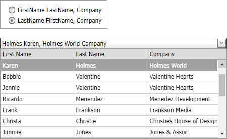

<!-- default badges list -->

[](https://supportcenter.devexpress.com/ticket/details/E1331)
[](https://docs.devexpress.com/GeneralInformation/403183)
[](#does-this-example-address-your-development-requirementsobjectives)
<!-- default badges end -->

# Combo Box for ASP.NET Web Forms -  How to format input text for multi-column combo box

In multi-column mode, the edit box displays the selected row’s values separated by a semicolon. Use the [TextFormatString](https://docs.devexpress.com/AspNet/DevExpress.Web.ASPxAutoCompleteBoxBase.TextFormatString) property to format the selected item’s output text. The text pattern can contain literals and indexed placeholders such as `{0}`, `{1}`, and so on.



## Implementation Details

In this example, a radio button list control allows users to select a pattern to apply to the combo box text. The [ASPxRadioButtonList.SelectedIndexChanged](https://docs.devexpress.com/AspNet/DevExpress.Web.ASPxListEdit.SelectedIndexChanged) event handler sets the [ASPxComboBox.TextFormatString](https://docs.devexpress.com/AspNet/DevExpress.Web.ASPxAutoCompleteBoxBase.TextFormatString) property according to the selected pattern.

```cs
protected void ASPxRadioButtonList1_SelectedIndexChanged(object sender, EventArgs e) {
    if (ASPxRadioButtonList1.SelectedIndex == 0) { 
        ASPxComboBox1.TextFormatString = "{0} {1}, {2} Company";   
    }
    if (ASPxRadioButtonList1.SelectedIndex == 1) { 
        ASPxComboBox1.TextFormatString = "{1} {0}, {2} Company";
    }      
}
```

## Files to Review

* [Default.aspx](./CS/WebSite/Default.aspx) (VB: [Default.aspx](./VB/WebSite/Default.aspx))
* [Default.aspx.cs](./CS/WebSite/Default.aspx.cs) (VB: [Default.aspx.vb](./VB/WebSite/Default.aspx.vb))
<!-- feedback -->
## Does this example address your development requirements/objectives?

[](https://www.devexpress.com/support/examples/survey.xml?utm_source=github&utm_campaign=asp-net-web-forms-combobox-format-multi-column-text&~~~was_helpful=yes) [](https://www.devexpress.com/support/examples/survey.xml?utm_source=github&utm_campaign=asp-net-web-forms-combobox-format-multi-column-text&~~~was_helpful=no)

(you will be redirected to DevExpress.com to submit your response)
<!-- feedback end -->
